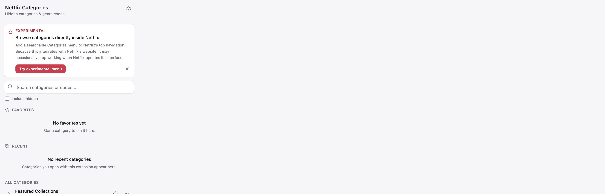
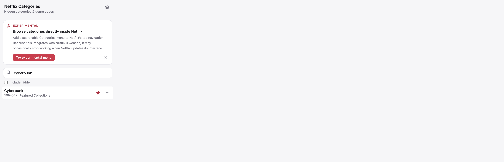
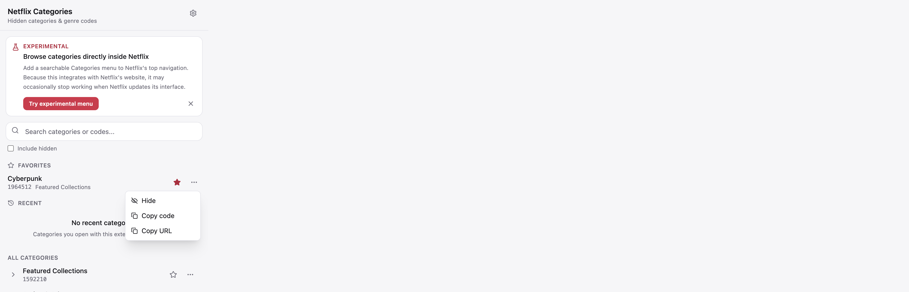
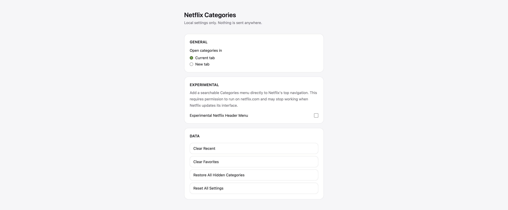
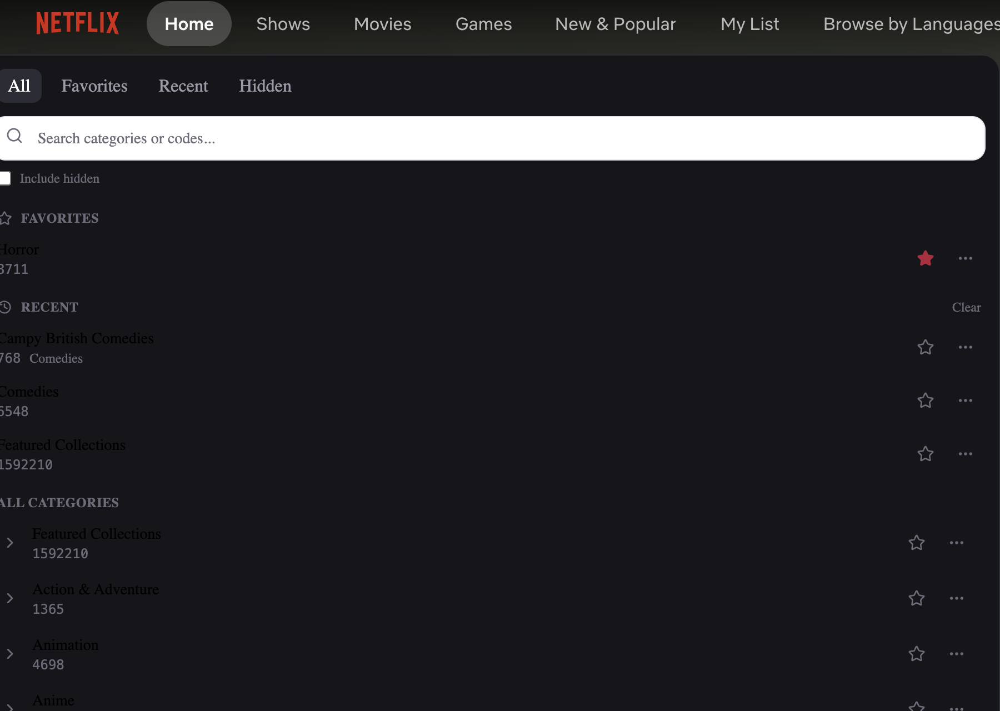

# Netflix Categories

Unofficial, open-source Chrome extension for browsing Netflix's hidden categories and secret genre codes.











Netflix Categories is an unofficial open-source project and is not affiliated with, endorsed by, or sponsored by Netflix. Netflix is a trademark of its respective owner.

## Features

- Search thousands of bundled hidden category and genre codes
- Open a category in this tab or a new tab from each row
- Favorites, Hidden, and Recent lists stored locally
- Optional experimental Hidden Categories menu in Netflix's header
- No account, cookies, analytics, or remote category API

## Installation

### Chrome Web Store

Store listing coming after the first review. Until then, load the unpacked production build (below).

### Load unpacked

1. `bun run build`
2. Open `chrome://extensions`
3. Enable Developer Mode
4. Click **Load unpacked**
5. Select `.output/chrome-mv3`

## Local development

Required Bun version is in `package.json` (`packageManager`).

```bash
git clone https://github.com/antick/netflix-categories-chrome.git
cd netflix-categories-chrome
bun install
bun run dev
```

WXT starts a development browser with the extension loaded. Edit popup/options/content scripts and they reload.

### Commands

```bash
bun run dev
bun run build
bun run zip
bun run check
bun run check:fix
bun run format
bun run typecheck
bun run test
bun run validate:data
```

### Testing

Automated tests use Bun:

```bash
bun run test
```

Manual popup checks: load the unpacked build, open the popup, search a name and a code, favorite/hide/open a category.

### Experimental Netflix header

1. Load the extension.
2. Open the popup.
3. Enable **Hidden Categories in Netflix header** (or the compact Try control in the popup).
4. Approve the Netflix site permission.
5. Visit or refresh Netflix while logged in.
6. Confirm **Hidden Categories** in the top navigation, left of Search.
7. Test search, Favorite, Hide, Recent, and Tab/New.
8. Disable the feature and confirm injection stops.

If Netflix's header cannot be found, the popup still works. This integration can break after Netflix UI updates.

## Updating category data

1. Research codes from public sources (prefer [Tudum](https://www.netflix.com/tudum/articles/netflix-secret-codes-guide)).
2. Verify names and codes.
3. Edit `data/netflix-categories.json`.
4. Update `updatedAt`.
5. Update `docs/CATEGORY_DATA.md` if sources change.
6. Run `bun run validate:data`, `bun run test`, and `bun run build`.
7. Open a PR.

Details: [docs/CATEGORY_DATA.md](docs/CATEGORY_DATA.md).

## Privacy

This extension does not collect or transmit personal data. Favorites, hidden categories, recent category selections, and extension settings are stored locally in the browser.

Optional Netflix permission is requested only if you enable the experimental header menu. It is used to attach an extension-owned menu on `netflix.com`. The extension does not read cookies, credentials, viewing history, or account data.

## Permissions

- `storage` — Favorites, Hidden, Recent, settings
- `activeTab` — open a category from a user click
- optional `scripting` + `https://www.netflix.com/*` — experimental header menu only

## Contributing

See [CONTRIBUTING.md](CONTRIBUTING.md).

## Disclaimer

Netflix Categories is an unofficial open-source project and is not affiliated with, endorsed by, or sponsored by Netflix.

- Netflix is a trademark of its respective owner.
- Category availability can vary by region.
- Category codes can change.
- Experimental header integration can break after Netflix UI updates.

## License

MIT. See [LICENSE](LICENSE).
